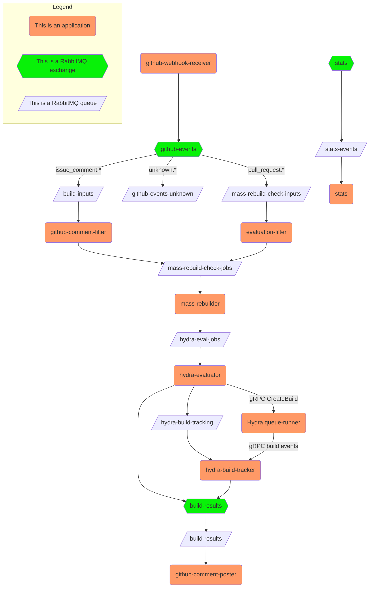

# Architecture

## Overview

ofborg is a Rust-based CI system for [Nixpkgs](https://github.com/nixos/nixpkgs). It runs as a
[GitHub App](https://docs.github.com/en/apps) that automatically processes pull requests and issue
comments. The system uses **RabbitMQ** for asynchronous message passing between components. Each
component runs as an independent process communicating exclusively through exchanges and queues.

## Components

| Binary | Purpose | Consumes From | Publishes To |
|--------|---------|---------------|--------------|
| `github-webhook-receiver` | HTTP server receiving GitHub webhooks. Validates HMAC-SHA256 signatures, parses the event type, and routes raw JSON to RabbitMQ. | GitHub HTTP POST | `github-events` (topic exchange) |
| `github-comment-filter` | Consumes issue comment events, parses `@ofborg` commands (`build` / `eval`), checks ACL (repo authorization, trusted users), fetches PR data from GitHub API, and schedules build/eval jobs. | `build-inputs` queue | `build-inputs-{system}` queues (via default exchange), `mass-rebuild-check-jobs` (queue via default exchange), `build-results` (fanout exchange) |
| `evaluation-filter` | Filters pull request events for mass rebuild evaluation. Only processes Opened, Synchronize, Reopened, and Edited (base change) events on authorized repos. | `mass-rebuild-check-inputs` queue | `mass-rebuild-check-jobs` (queue via default exchange) |
| `mass-rebuilder` | Runs nixpkgs evaluation to determine which packages a PR impacts. Clones nixpkgs, merges the PR, runs nix-instantiate on release expressions, computes the diff of out-paths, and optionally publishes evaluation results to the hydra evaluator. | `mass-rebuild-check-jobs` queue | `hydra-eval-jobs` (queue via default exchange) |
| `github-comment-poster` | Creates and updates GitHub Check Runs on pull requests. `QueuedBuildJobs` and `BuildResult` each create a check run; `HydraBuildUpdate` **advances** one check run through queued → in progress → completed. | `build-results` queue (via `build-results` fanout) | GitHub Check Runs API |
| `hydra-evaluator` | Imports evaluated derivations into the Hydra queue-runner over gRPC and calls `CreateBuild`. Publishes one tracking record per created build, plus an immediate queued check run. | `hydra-eval-jobs` queue | queue-runner gRPC, `hydra-build-tracking` queue, `build-results` (fanout exchange) |
| `hydra-build-tracker` | Subscribes to the queue-runner's build event stream and joins those events against the tracking records, so build progress (including which machine a build landed on) and the final result reach GitHub. | `hydra-build-tracking` queue, queue-runner gRPC event stream | `build-results` (fanout exchange) |
| `stats` | Dual-purpose binary: (1) Prometheus metrics HTTP server at `/metrics`, (2) consumer of `EventMessage` payloads from the stats exchange for metric collection. | `stats-events` queue (via `stats` fanout) | HTTP Prometheus `/metrics` |

> **Note:** ofborg no longer runs builds itself. `github-comment-filter` still publishes `BuildJob`
> messages to the `build-inputs-{system}` queues, but the `builder` binary that used to consume them
> was removed — all building now happens in the Hydra queue-runner.


## Data Flow

### 1. Webhook Reception

GitHub sends webhook events to `github-webhook-receiver` via HTTP POST. The receiver validates the
`X-Hub-Signature-256` HMAC header, parses the `X-GitHub-Event` header, and publishes the raw JSON
body to the `github-events` **topic exchange** with a routing key of `{event}.{owner}/{repo}` (e.g.,
`pull_request.nixos/nixpkgs`).

```
GitHub ──HTTP POST──▶ github-webhook-receiver ──publish──▶ github-events (topic)
```

### 2. Direct Build Flow (Issue Comments)

When someone comments `@ofborg build` on a PR:

1. **`github-comment-filter`** consumes the `issue_comment.*` event from `build-inputs` queue.
2. It parses the comment, checks the ACL (authorized repos, trusted users), fetches PR data from the
   GitHub API, and publishes:
   - A `BuildJob` message directly to `build-inputs-{system}` queues (one per architecture, via default exchange).
   - A `QueuedBuildJobs` message to the `build-results` **fanout exchange** (for creating in-progress
     check runs).

```
github-events ──issue_comment.*──▶ build-inputs ──▶ github-comment-filter
                                                       ├──▶ build-inputs-x86_64-linux
                                                       ├──▶ build-inputs-aarch64-linux
                                                       ├──▶ build-inputs-x86_64-darwin
                                                       ├──▶ build-inputs-aarch64-darwin
                                                       └──▶ build-results (fanout)
```

### 3. Mass Rebuild Flow (Pull Requests)

When a PR is opened or updated:

1. **`evaluation-filter`** consumes the `pull_request.*` event from `mass-rebuild-check-inputs`.
   This queue has two bindings to `github-events`: `pull_request.*` (from the webhook-receiver) and
   `pull_request.nixos/*` (from the evaluation-filter itself).
2. It filters for Opened, Synchronize, Reopened, and Edited (base change) actions on authorized
   repos (`nixos/*`).
3. Publishes an `EvaluationJob` to `mass-rebuild-check-jobs`.

```
github-events ──pull_request.*──▶ mass-rebuild-check-inputs ──▶ evaluation-filter
                                                                  └──▶ mass-rebuild-check-jobs
```

4. **`mass-rebuilder`** consumes `EvaluationJob` from `mass-rebuild-check-jobs`. It clones nixpkgs,
   checks out the target branch, merges the PR, runs nix-instantiate on `nixos/release.nix` and
   `pkgs/top-level/release.nix`, computes the diff of out-paths between base and merge, and
   optionally publishes evaluation results to the `hydra-eval-jobs` queue.

```
mass-rebuild-check-jobs ──▶ mass-rebuilder ──▶ hydra-eval-jobs
```

The `HydraEvalJob` carries one `(attr, drv_path)` pair per derivation plus the system they were
instantiated for. The attribute name is kept because it is what the GitHub check run is named
after — a bare store path only yields the derivation name, which is not the same thing.

### 4. Hydra Build Flow

**`hydra-evaluator`** consumes `HydraEvalJob`, streams the derivations into the queue-runner and
calls `CreateBuild`, which answers with a `drv_path → build_id` map. For each build it then:

- publishes a `HydraBuildTracking` record to the durable `hydra-build-tracking` queue, and
- publishes a queued `HydraBuildUpdate` to `build-results`, so the check run shows up on the PR
  immediately — even if the tracker happens to be down.

**`hydra-build-tracker`** consumes `hydra-build-tracking` **without acking**. Every unacked delivery
is a build still in flight, which makes the queue the tracker's state: restart it and RabbitMQ
redelivers exactly the builds that had not finished. In parallel it subscribes to the queue-runner's
build event stream and, for each event matching a tracked build, publishes a `HydraBuildUpdate`.
A terminal event acks the tracking record. A periodic sweep gives up on builds Hydra never reported
on, so a lost event cannot leave a PR showing a build in progress forever.

```
hydra-eval-jobs ──▶ hydra-evaluator ──gRPC CreateBuild──▶ queue-runner
                      ├──▶ hydra-build-tracking ──▶ hydra-build-tracker ◀──gRPC events── queue-runner
                      └──▶ build-results (fanout)          └──▶ build-results (fanout)
```

### 5. Build Results

**`github-comment-poster`** consumes from the `build-results` queue (bound to the `build-results`
fanout exchange). It receives three message types:
- `QueuedBuildJobs` — creates an in-progress GitHub Check Run on the PR.
- `BuildResult` — creates a completed GitHub Check Run (success/failure).
- `HydraBuildUpdate` — *updates* a check run in place, so one build produces one check run that
  moves through queued → in progress (naming the builder machine) → completed, linking to its Hydra
  build page. The check run id is resolved from an in-process LRU, falling back to listing the
  commit's check runs by name.

```
build-results (fanout) ──▶ build-results queue ──▶ github-comment-poster ──▶ GitHub Checks API
```

### 6. Stats / Metrics

Components publish `EventMessage` payloads to the `stats` fanout exchange. The `stats` binary
consumes them from the `stats-events` queue and exposes collected metrics as Prometheus text format
at `/metrics` over HTTP.

```
components ──▶ stats (fanout) ──▶ stats-events queue ──▶ stats (Prometheus HTTP /metrics)
```

## RabbitMQ Topology

### Exchanges

| Exchange | Type | Purpose |
|----------|------|---------|
| `github-events` | Topic | Ingress for all raw GitHub webhook events. Routing keys: `{event}.{owner}/{repo}` |
| `build-results` | Fanout | Distributes `BuildResult` and `QueuedBuildJobs` to all interested consumers |
| `stats` | Fanout | Distributes `EventMessage` metrics payloads |

### Queues

| Queue | Type | Exchange Binding | Routing Key | Consumer |
|-------|------|------------------|-------------|----------|
| `build-inputs` | Durable | `github-events` | `issue_comment.*` | `github-comment-filter` |
| `github-events-unknown` | Durable | `github-events` | `unknown.*` | — (no consumer) |
| `mass-rebuild-check-inputs` | Durable | `github-events` | `pull_request.*` (webhook-receiver), `pull_request.nixos/*` (evaluation-filter) | `evaluation-filter` |
| `mass-rebuild-check-jobs` | Durable | Default exchange | `mass-rebuild-check-jobs` (routing key = queue name) | `mass-rebuilder` |
| `hydra-eval-jobs` | Durable | Default exchange | `hydra-eval-jobs` (routing key = queue name) | `hydra-evaluator` |
| `hydra-build-tracking` | Durable | Default exchange | `hydra-build-tracking` (routing key = queue name) | `hydra-build-tracker` (consumes without acking; see above) |
| `build-results` | Durable | `build-results` (fanout) | — | `github-comment-poster` |
| `stats-events` | Durable | `stats` (fanout) | — | `stats` |

## RabbitMQ Graph



## Message Types

| Message | Serialization | Fields | Published To |
|---------|---------------|--------|--------------|
| `BuildJob` | JSON | `repo`, `pr`, `system`, `attrs`, `checkout` | `build-inputs-{system}` queues (via default exchange) |
| `EvaluationJob` | JSON | `repo`, `pr`, `system` | `mass-rebuild-check-jobs` queue |
| `QueuedBuildJobs` | JSON | `repo`, `pr`, `attempt_id`, `total_jobs` | `build-results` exchange |
| `BuildResult` | JSON | `repo`, `pr`, `attempt_id`, `status` (Success/Failure), `system`, `attrs` | `build-results` exchange |
| `HydraEvalJob` | JSON | `repo`, `pr`, `system`, `drvs` (`attr` + `drv_path`), `request_id`, `jobset_id` | `hydra-eval-jobs` queue |
| `HydraBuildTracking` | JSON | `repo`, `pr`, `attr`, `system`, `drv_path`, `build_id`, `jobset_id`, `request_id`, `queued_at` | `hydra-build-tracking` queue |
| `HydraBuildUpdate` | JSON | `tag` (`HydraV1`), `repo`, `pr`, `attr`, `system`, `build_id`, `machine`, `state` (Queued/Running/Finished), `hydra_base_url` | `build-results` exchange |
| `BuildEvent` | protobuf | `build_id`, `jobset_id`, `drv_path`, one of Queued / Running (machine + step status) / Finished (hydra build status + machine) / Lagged | queue-runner gRPC stream (`RunnerService.SubscribeBuildEvents`) |
| `EventMessage` | JSON | `event` (tagged enum), `repo`, `pr`, `value` | `stats` exchange |
| Raw webhook JSON | JSON | Raw GitHub webhook payload | `github-events` exchange |
